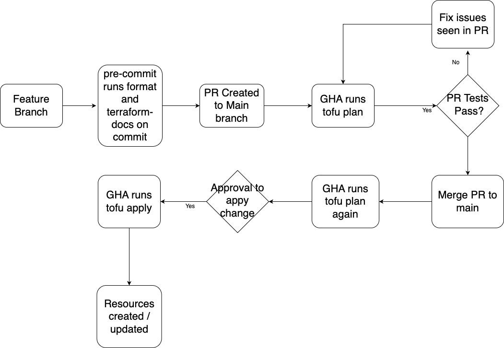

# CLOUDNOVA INFRA

Here lies the AWS IAC written in terraform for the CloudNova product. Leveraging already existing code used by the community, (AWS Terraform Module)[https://registry.terraform.io/namespaces/terraform-aws-modules] will be used. This IAC will create the following:

- VPC
- Private and Public Subnets
- EKS
- IAM
- KMS
- Cluster Addons
- OIDC for cluster

# Cloud Infra CICD
Github actions is used for this deployment process. AWS OICD is used for authentication between Github and AWS to avoid adding AWS secrets and keys in Github.

### Steps to deploy changes
- Check the contributing section below to see how to setup pre-commit
- Create PR to main branch
- GHA runs `tofu plan` to review changes. Plan output is commented into PR for reviewer
- Once PR is merged, GHA runs apply workflow. This will do another plan again and after that create an issue to get manual approval before apply can

<!-- BEGIN_TF_DOCS -->
## Requirements

| Name | Version |
|------|---------|
|  [terraform](#requirement\_terraform) | ~> 1.8 |
|  [aws](#requirement\_aws) | ~> 5.95 |
|  [helm](#requirement\_helm) | ~> 2.17 |
|  [kubectl](#requirement\_kubectl) | ~> 1.19 |

## Providers

| Name | Version |
|------|---------|
|  [aws](#provider\_aws) | 5.97.0 |
|  [helm](#provider\_helm) | 2.17.0 |
|  [kubernetes](#provider\_kubernetes) | 2.36.0 |

## Modules

| Name | Source | Version |
|------|--------|---------|
|  [allow\_eks\_access\_iam\_policy](#module\_allow\_eks\_access\_iam\_policy) | terraform-aws-modules/iam/aws//modules/iam-policy | ~> 5.39 |
|  [eks](#module\_eks) | terraform-aws-modules/eks/aws | 20.8.5 |
|  [eks\_admins\_iam\_role](#module\_eks\_admins\_iam\_role) | terraform-aws-modules/iam/aws//modules/iam-assumable-role | ~> 5.39 |
|  [vpc](#module\_vpc) | terraform-aws-modules/vpc/aws | ~> 5.21 |
|  [vpc\_cni\_irsa](#module\_vpc\_cni\_irsa) | terraform-aws-modules/iam/aws//modules/iam-role-for-service-accounts-eks | n/a |

## Resources

| Name | Type |
|------|------|
| [helm_release.these](https://registry.terraform.io/providers/hashicorp/helm/latest/docs/resources/release) | resource |
| [kubernetes_namespace.argocd](https://registry.terraform.io/providers/hashicorp/kubernetes/latest/docs/resources/namespace) | resource |
| [aws_caller_identity.current](https://registry.terraform.io/providers/hashicorp/aws/latest/docs/data-sources/caller_identity) | data source |
| [aws_partition.current](https://registry.terraform.io/providers/hashicorp/aws/latest/docs/data-sources/partition) | data source |

## Inputs

No inputs.

## Outputs

| Name | Description |
|------|-------------|
|  [eks\_details](#output\_eks\_details) | n/a |
|  [vpc\_details](#output\_vpc\_details) | n/a |
<!-- END_TF_DOCS -->

## Contributing

### Pre-commit config

This repository has [pre-commit](https://github.com/antonbabenko/pre-commit-terraform) set up configured. You will need to have the following installed on your local computer. We have pre-commit set up for `terraform fmt` and `terraform-docs`. In the future we would like to add other support actions like `tfsec` or `trivy`.

- Pre-commit: Initialize pre-commit by running `pre-commit install` in the root directory of the repository
- Install pre-commit cli
- Install Terraform CLI
- Install Terraform Docs
